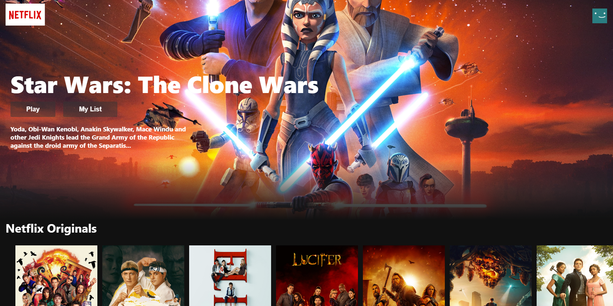
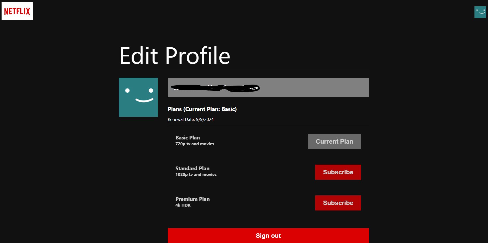

# Netflix Clone

This project is a full-stack Netflix clone built using React for the frontend, Redux for state management, Firebase for authentication, Stripe for payment processing, and the IMDb API for fetching movie and TV show data. The app supports user authentication, subscription payments, and streaming of movies and TV shows.

## Table of Contents

- [Demo](#demo)
- [Features](#features)
- [Tech Stack](#tech-stack)
- [Setup and Installation](#setup-and-installation)
- [Running the App](#running-the-app)
- [Credit](#credit)


## Demo

You can check out the live demo of the app here: [Netflix Clone Demo](https://netflix-clone-fs.web.app)




## Features

- **User Authentication**: Secure sign-up and login using Firebase Authentication.
- **Stripe Payments**: Integrated Stripe for managing subscription payments.
- **Subscription Tiers**: Users can subscribe to different plans (e.g., Basic, Standard, Premium).
- **Redux for State Management**: Centralized state management using Redux.
- **Movie and TV Show Data**: Fetches data from the IMDb API, including details, ratings, and trailers.
- **Responsive Design**: Fully responsive and works on all device sizes.
- **User Profiles**: Manage profile.
- **Movie/TV Show Details**: View detailed information, including a synopsis (more available in API).

## Tech Stack

### Frontend
- **React**: JavaScript library for building user interfaces.
- **Redux**: State management library.
- **React Router DOM**: For routing and navigation.
- **CSS Modules**: Scoped and modular CSS.

### Backend
- **Firebase**: Used for authentication, database, and hosting.
- **Stripe**: Payment processing and subscription management.
- **IMDb API**: Fetches movie and TV show data.

## Setup and Installation

### Prerequisites

- Node.js and npm installed on your local machine.
- A Firebase project set up with authentication enabled.
- A Stripe account for handling payments.
- An IMDb API key.

### Installation

1. Clone the repository and install dependencies:
   ```bash
   git clone https://github.com/blankz1035/netflix-clone-fs.git
   cd netflix-clone-fs
   npm install

2. Create .env file for variables:
   ```bash
   REACT_APP_API_KEY = YourKey

## Running the APP
### To run the app in development mode, use the following command:
```bash
    npm start
```
Open http://localhost:3000 to view it in the browser. The page will reload if you make edits.
### Production build
```bash
    npm run build
```
This will create a build directory with the optimized production build.

### Deploy to Firebase
```bash
    npm run build
    firebase login
    firebase init (to create app under your project)
    firebase deploy
```
This will deploy your app to Firebase Hosting.

#### Credit
This project was inspired by https://www.youtube.com/watch?v=HW5roUF2RLg&t=5016s&ab_channel=SonnySangha

